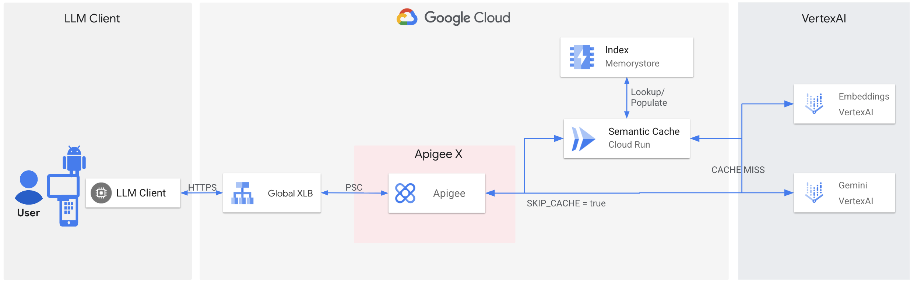

# Redis Semantic Cache on Cloud Run via Apigee

This project provides a solution for implementing a semantic cache for LLM (Large Language Model) responses using Redis (Memorystore) and Gemini (Vertex AI) on Cloud Run, with Apigee X serving as the secure API Gateway to route requests and manage the flow.

---

## Project Structure

-   **`semantic-cache/`**: Folder containing the Cloud Run application.
    -   **`app.py`**: Flask web application that handles requests and manages the semantic cache.
    -   **`Dockerfile`**: Defines the container image for Cloud Run.
    -   **`requirements.txt`**: Python dependencies.

-   **`env.sh`**: Environment variables configuration file.
-   **`deploy-redis.sh`**: Shell script to create Memorystore for Redis (version 7.2+) on GCP.
-   **`deploy-cloudrun.sh`**: Shell script to build and deploy the application to Cloud Run, including setting up firewall rules and service accounts.
-   **`deploy-apiproxy.sh`**: Shell script to upload and deploy the Apigee API Proxy.
-   **`clear-redis.sh`**: Shell script to clear all data in Redis via Cloud Run endpoint.
-   **`undeploy-all.sh`**: Shell script to clean up all created resources on GCP.
-   **`apiproxy/`**: Apigee API Proxy bundle named `llm-redis-cache-v1` that routes traffic to Cloud Run.

---

## Architecture and Workflow

### 1. Semantic Caching Concept
-   When a user sends a prompt, the system checks if a similar prompt has been processed before.
-   It uses **Vertex AI Embeddings** (`text-embedding-004`) to convert the prompt into a vector.
-   It searches **Memorystore for Redis** (version 7.2+) for the most similar stored vector.
-   If a highly similar prompt is found (**Cache Hit**), it returns the cached response, saving cost and time.
-   If no similar prompt is found (**Cache Miss**), it forwards the incoming request directly to the **Vertex AI REST API**, returns the response, and stores it in Redis for future use.

### 2. Infrastructure
-   **Apigee X**: Acts as the secure API Gateway. Receives client requests and routes them to the Cloud Run backend. (Proxy Name: `llm-redis-cache-v1`)
-   **Cloud Run**: Hosts the Flask app that serves as the backend API and manages the semantic cache logic. (Service Name: `semantic-cache`)
-   **Memorystore for Redis**: Stores the embeddings and cached responses, providing low-latency vector search. (Instance ID: `redis-semantic-cache`)
-   **Vertex AI**: Provides the embedding model and the LLM.
-   **Direct VPC Egress**: Connects Cloud Run to the VPC network where Redis resides without needing a connector.

### 3. Workflow
1.  **Client** calls the Apigee API Proxy.
2.  **Apigee** forwards the request to the **Cloud Run** service.
3.  **Cloud Run** executes the semantic cache logic:
    *   Checks Redis for similar prompts.
    *   If found, returns cached response.
    *   If not found, forwards the request to Vertex AI REST API, caches the result in Redis, and returns the response.

---

## Installation and Deployment

### 1. Prerequisites
-   Google Cloud Project with billing enabled.
-   `gcloud` CLI installed and authenticated.
-   Application Default Credentials (ADC) set up:
    ```bash
    gcloud auth application-default login
    ```

### 2. Setup and Deployment

1.  **Configure Environment**: Edit `env.sh` to set your `PROJECT_ID`, `REGION`, and other variables.
    ```bash
    source env.sh
    ```
2.  **Create Redis Instance**: Run the script to create Memorystore for Redis.
    ```bash
    ./deploy-redis.sh
    ```
    *Note: This script creates a Redis 7.2 instance required for vector search.*
3.  **Update Redis IP**: After Redis is created, get its IP address and update `REDIS_IP` in `env.sh`. Then run `source env.sh` again to apply the changes.
4.  **Deploy to Cloud Run**: Run the deployment script. This will also automatically update the Apigee target endpoint with the Cloud Run URL.
    ```bash
    ./deploy-cloudrun.sh
    ```
    *This script will enable required APIs, create a service account with necessary roles, set up a firewall rule, and deploy the app.*
5.  **Deploy Apigee Proxy**: Run the script to upload and deploy the Apigee API Proxy.
    ```bash
    ./deploy-apiproxy.sh
    ```

### 3. Testing

You can test the semantic cache and Apigee proxy integration using the provided Jupyter notebook.

-   **Test Notebook**: `notebook/llm_redis_cache_v1.ipynb`
-   **Environment**: Designed to be run in **Vertex AI Colab Enterprise** or any Jupyter environment.
-   **Test Scenarios**:
    1.  **Bypass Cache**: Send a request with the header `x-skipCache: true`. This instructs Apigee to route the request directly to Vertex AI, bypassing the Cloud Run semantic cache entirely.
    2.  **Cached Flow** (When `x-skipCache` is not `true` or omitted):
        *   **Cache Miss**: Send a new or unique request. The response header `X-Cache` will be `MISS`.
        *   **Cache Hit**: Send the same or a semantically similar request again. The response header `X-Cache` will be `HIT`, and `X-Cache-Score` will show the similarity score.

### 4. Clearing Cache

If you need to clear the cache (e.g., for testing different endpoints or forcing fresh LLM calls), you can run the following script:
```bash
./clear-redis.sh
```
*Note: This script calls a secure endpoint on Cloud Run to flush Redis and recreate the index. It uses your active Google credentials to authenticate.*

---

## References & Related Concepts

This project implements a custom semantic cache tailored for Google Cloud Memorystore for Redis (version 7.2+) and Vertex AI. While it is a custom implementation, it is inspired by and references the following concepts and documentation:

-   **Redis Semantic Cache**: The concept of using vector similarity search to cache LLM responses based on semantic meaning rather than exact string matching. [Redis Semantic Cache Documentation](https://redis.io/docs/latest/develop/ai/redisvl/0.7.0/user_guide/llmcache/)
-   **LangChain Redis Semantic Cache**: LangChain provides built-in support for Redis semantic caching, which served as a reference for the workflow. [LangChain LLM Caching Documentation](https://reference.langchain.com/python/langchain-redis/cache/RedisSemanticCache)
-   **GCP Memorystore for Redis Vector Search**: Memorystore for Redis (version 7.2+) supports vector search capabilities, enabling low-latency generative AI use cases. [Memorystore Vector Search Documentation](https://docs.cloud.google.com/memorystore/docs/redis/about-vector-search)

---

## Cleanup

To delete all resources created by this project, run:
```bash
./undeploy-all.sh
```
